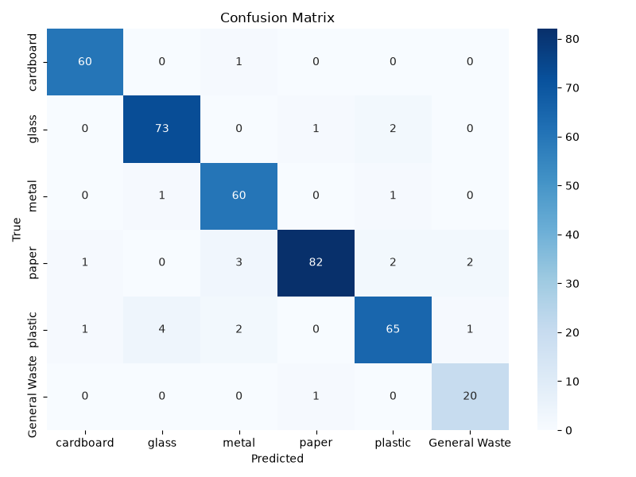
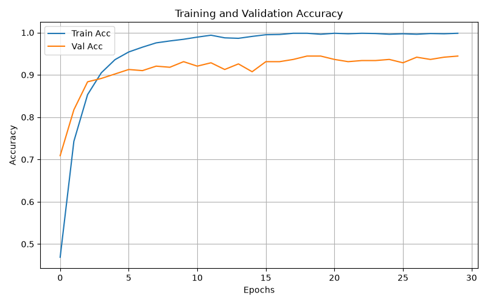
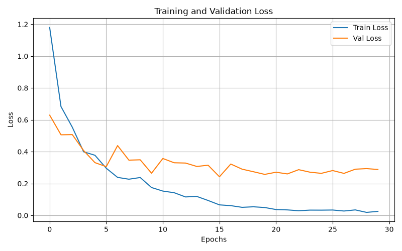

# ♻️ Trash Classification System

[](https://github.com/yutongyu-ai/Trash_Classification_System/actions/workflows/ci.yml)
[](https://share.streamlit.io)

An end-to-end deep learning application for real-time waste image classification using **ResNet18**, **FastAPI**, **Streamlit**, and **Docker**.

The system classifies waste images into six categories from the TrashNet dataset and provides an interactive web interface for inference. The project is fully containerized for portable and scalable deployment.

---

# 🚀 Features

- Fine-tuned **ResNet18** model for 6-class waste classification
- Real-time inference with FastAPI backend
- Interactive Streamlit frontend
- Dockerized full-stack deployment
- Low-latency prediction pipeline (33ms ± 9ms per request, CPU inference)
- Clean modular project structure
- Portable and reproducible environment

---

# 🧠 Model Performance

| Metric | Result |
|---|---|
| Model Architecture | ResNet18 |
| Dataset | TrashNet |
| Classes | 6 |
| Best Validation Accuracy | 94.4% (epoch 17/30) |
| Test Accuracy | 94.0% (360/383 images) |
| Inference Latency | 33ms ± 9ms (mean ± std, N=30) |

Latency measured end-to-end through the `/predict` endpoint (upload →
decode → preprocess → forward pass → response), 30 requests after 5
discarded warm-up requests, against the Dockerized FastAPI backend on
WSL2, CPU inference — matches the actual deployed serving path rather
than a bare model benchmark.

## Per-Class Results (test set, 383 images)

Auto-generated each training run via `sklearn.metrics.classification_report`
and logged as an MLflow artifact (`classification_report.json`) — see
[Experiment Tracking](#experiment-tracking) below.

| Class | Support | Precision | Recall | F1 |
|---|---|---|---|---|
| cardboard | 61 | 96.8% | 98.4% | 97.6% |
| glass | 76 | 93.6% | 96.1% | 94.8% |
| metal | 62 | 90.9% | 96.8% | 93.8% |
| paper | 90 | 97.6% | 91.1% | 94.3% |
| plastic | 73 | 92.9% | 89.0% | 90.9% |
| General Waste | 21 | 87.0% | 95.2% | 90.9% |

`General Waste` has the weakest precision and by far the fewest test examples
(21, vs. 61-90 for the others); `plastic` has the weakest recall despite
having plenty of support, so that gap looks more like genuine visual overlap
with another class (its confusion matrix column is worth checking) than a
data-volume problem. TrashNet's class imbalance is handled during training
via inverse-frequency class weighting (`utils/datasets.py::get_class_weights`),
which helps the training signal, but 21 `General Waste` test images is still
a small sample to generalize from — more `General Waste`-class data would
likely help more than further loss reweighting at this point.



## Training Curves

Train accuracy climbs to ~99.6% while validation accuracy plateaus around
91-94% from epoch ~8 onward — the growing train/val gap and validation
loss flattening (while training loss keeps dropping) are signs of
overfitting on this small (~2,500 image) dataset, despite the
augmentation (random flip/rotation) and dropout (p=0.5) already in the
training pipeline. The checkpoint actually shipped is whichever epoch had
the best validation accuracy (epoch 17 here), not the final epoch, so this
doesn't directly hurt the deployed model's accuracy — but it's a signal
that stronger augmentation, partial backbone freezing, or more data would
likely generalize better than training longer.

| Accuracy | Loss |
|---|---|
|  |  |

---

# 🗂️ Waste Categories

The model classifies images into the following categories:

- 📦 Cardboard
- 🍾 Glass
- 🥫 Metal
- 📄 Paper
- 🧴 Plastic
- 🗑️ General Waste

---

# 🏗️ System Architecture

```text
             ┌────────────────────┐
             │     Streamlit      │
             │   Frontend UI      │
             └─────────┬──────────┘
                       │ HTTP Request
                       ▼
             ┌────────────────────┐
             │      FastAPI       │
             │   Inference API    │
             └─────────┬──────────┘
                       │
                       ▼
             ┌────────────────────┐
             │    ResNet18 Model  │
             │   PyTorch Runtime  │
             └────────────────────┘
```

---

# 🛠️ Tech Stack

## Backend
- Python
- FastAPI
- PyTorch
- Torchvision
- Pillow
- Uvicorn

## Frontend
- Streamlit
- Requests

## Deployment
- Docker
- Docker Compose

---

# 📦 Dockerized Deployment

The application is fully containerized using Docker Compose.

## Services

| Service | Description |
|---|---|
| `backend` | FastAPI inference server |
| `frontend` | Streamlit web application |

The `backend` service runs CPU-only inference by default. For a single-image
ResNet18 forward pass, CPU latency is generally fine for interactive use; GPU
acceleration mainly pays off for batch training/inference, not this service.

## Model Weights

No manual setup needed — on first startup, `backend` automatically downloads
the trained checkpoint from
[Hugging Face Hub](https://huggingface.co/tonghahaha/trashnet-resnet18) if
`checkpoints/best_resnet18_trashnet.pth` isn't already present locally (e.g.
from running your own training via `main.py`, which runs Optuna HPO then a
full training pass — see `hpo.py`/`train.py`; on a SLURM cluster this is
typically submitted as a batch job, not run directly). A local checkpoint
always takes priority over the hosted one.

---

# 🌐 Live Demo

`streamlit_app.py` (repo root) is a standalone entry point deployed on
[Streamlit Community Cloud](https://share.streamlit.io) — it calls
`backend/inference.py`'s `predict()` directly in-process instead of over
HTTP, since Community Cloud only runs a single Python process. This is
separate from `frontend/app.py`, which still talks to the FastAPI backend
over HTTP and is what `docker-compose.yml` and the "Running Without Docker"
setup below use — the two-service, API-driven architecture is still the one
actually developed and tested locally; the Streamlit Cloud version just
inlines it to fit that platform's single-process constraint.

To deploy your own copy:

1. Go to [share.streamlit.io](https://share.streamlit.io), sign in with
   GitHub, and click **New app**.
2. Pick this repo, branch `main`, and main file path `streamlit_app.py`.
3. Deploy — dependencies install from the root `requirements.txt`
   automatically, and the model checkpoint downloads from Hugging Face Hub
   on first run, same as the Docker setup.

A root `Dockerfile` + `start.sh` also exist for single-container Docker
deployment (e.g. Cloud Run, or Hugging Face Spaces on a paid plan — Spaces'
Docker/Gradio SDKs now require PRO/Team/Enterprise to create, so it's not
used for the free live demo above). See git history if that path is worth
revisiting later.

---

# ⚙️ Installation

## 1. Clone the Repository

```bash
git clone https://github.com/yutongyu-ai/Trash_Classification_System.git
cd Trash_Classification_System
```

---

## 2. Build and Run with Docker

```bash
docker compose up --build
```

The application will be available at:

| Service | URL |
|---|---|
| Streamlit Frontend | http://localhost:8501 |
| FastAPI Backend | http://localhost:8000 |

---

# 🧪 Running Without Docker

## Backend

```bash
cd backend

pip install -r requirements.txt

uvicorn main:app --host 0.0.0.0 --port 8000
```

---

## Frontend

```bash
cd frontend

pip install -r requirements.txt

streamlit run app.py
```

---

# 🧠 Training Pipeline

The model training pipeline includes:

- Data augmentation
- Transfer learning with ResNet18
- Hyperparameter optimization
- Validation monitoring
- Checkpoint saving
- Experiment tracking (MLflow)

## Experiment Tracking

`main.py` logs every Optuna HPO trial (`hpo.py`) and the final 30-epoch
training run to [MLflow](https://mlflow.org/) — per-epoch train/val
loss/acc, the winning hyperparameters, test accuracy, the per-class
classification report, the confusion matrix / training curve plots, the
checkpoint, and the model itself (`mlflow.pytorch.log_model`). Runs are
grouped into two experiments: `trashnet-hpo` (one run per trial) and
`trashnet-final-training` (the full run using the HPO winner's params).

Tracking data is stored locally in `./mlflow.db` (SQLite — MLflow 3.x's
default local backend for params/metrics) plus `./mlruns/` for the actual
logged files — plots, checkpoint, the logged model itself (both gitignored,
not meant to be committed). To browse it after a training run:

```bash
mlflow ui
```

Then open `http://localhost:5000` to compare trials by validation accuracy,
inspect per-epoch curves, and download any run's artifacts.

### Model Versioning

Every final-training run is registered as a new version of the
`trashnet-resnet18` model in MLflow's [Model
Registry](https://mlflow.org/docs/latest/model-registry.html) (also local,
in `./mlflow.db`). A `champion` alias tracks whichever version currently has
the best `test_acc` — a run only takes over the alias if it beats the
current champion, so a worse run never silently displaces a better one. When
a run is promoted, `main.py` also copies its checkpoint *and* its
plots/training-log (`outputs/trashnet_*`) over the previous champion's — a
non-winning run only ever touches its own scratch copies
(`checkpoints/_run_best.pth`, `outputs/_run_*`), never the shared files.

This was added after a near-miss earlier in this project's history, where a
fresh training run (92.2% test_acc) almost got manually pushed to Hugging
Face Hub over a better existing checkpoint (94.3%) — nothing at the time
checked whether the newest run was actually the best one.

Pushing the champion's checkpoint to HF Hub (what the deployed app actually
serves) is still a separate, manual step — the registry only decides
*which* local run deserves that promotion, it doesn't reach out to HF Hub
itself. The numbers and plots on this page reflect whatever run is
currently both the registry's `champion` *and* what's live on HF Hub.

### Reproducibility

`utils/seed.py::set_seed()` fixes the `random`/`numpy`/`torch` RNGs and
disables cuDNN's non-deterministic algorithm selection, called once before
each HPO trial and again before the final training run. This makes repeated
runs land on the same final `test_acc`, which is what the champion
comparison above relies on to be meaningful. It's not full epoch-by-epoch
determinism, though — two same-seed runs have matched on final `test_acc` in
practice but still show slightly different per-epoch numbers, most likely
from `DataLoader`'s `num_workers=4` worker processes not being pinned to the
main process's seed.

---

# 📁 Project Structure

```text
project/
│
├── backend/
│   ├── models/               # Model architecture and utilities
│   ├── Dockerfile
│   ├── inference.py          # Inference pipeline (loads from HF Hub if no local checkpoint)
│   ├── main.py               # FastAPI application
│   └── requirements.txt
│
├── frontend/
│   ├── app.py                # Streamlit frontend
│   ├── Dockerfile
│   └── requirements.txt
│
├── tests/                     # pytest suite (unit + integration tests)
├── docs/eval/                 # Evaluation plots referenced in this README
├── checkpoints/               # Model checkpoints (used for both training output and inference)
├── data/                      # Dataset directory
├── outputs/                   # Training outputs and logs
├── mlflow.db                  # MLflow tracking DB (gitignored, created by training runs)
├── mlruns/                    # MLflow logged files: plots, checkpoint, model (gitignored)
├── utils/                     # Utility functions
│
├── .github/workflows/ci.yml   # Lint, tests, Docker build check
├── docker-compose.yml         # Two-container local dev setup
├── Dockerfile                 # Single-container build (Cloud Run, HF Spaces on a paid plan, etc.)
├── start.sh                   # Launches backend + frontend in one container
├── streamlit_app.py           # Streamlit Community Cloud entry point (in-process inference)
├── requirements.txt           # Deps for streamlit_app.py on Streamlit Community Cloud
├── hpo.py                     # Hyperparameter optimization
├── train.py                   # Training script
├── main.py                    # Entry point: runs HPO then final training
├── README.md
```
